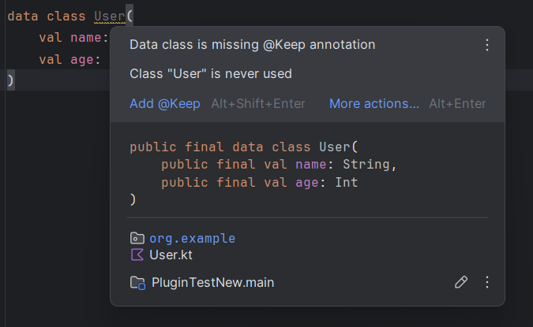

# DataClass Keep Plugin

<!-- Plugin description -->
An IntelliJ / Android Studio plugin that automatically detects Kotlin
data classes missing the `@Keep` annotation and offers a one-click fix.

When Android apps are minified using ProGuard or R8, data classes can
get renamed or removed causing runtime crashes. This plugin warns you
and fixes it automatically.
<!-- Plugin description end -->
## The Problem

When Android apps are minified using ProGuard or R8, data classes can
get renamed or removed, causing runtime crashes. The `@Keep` annotation
prevents this — but it's easy to forget to add it.

## What This Plugin Does

- Shows a warning on any `data class` missing `@Keep`
- Detects Retrofit response classes missing `@Keep`
- Offers a one-click quick fix to add it automatically
- Works in both IntelliJ IDEA and Android Studio

## Demo



When a data class is missing `@Keep`, the plugin shows a warning
and offers a one-click fix directly in the editor.

## Installation

### From JetBrains Marketplace
> Coming soon

### Manual
1. Download the latest `.zip` from [Releases](../../releases)
2. In IntelliJ/Android Studio → `Settings → Plugins → ⚙️ → Install Plugin from Disk`
3. Select the downloaded `.zip`
4. Restart the IDE

## Usage

1. Open any Kotlin file with a data class
2. If `@Keep` is missing, you'll see a yellow warning underline
3. Click the 💡 lightbulb → select **"Add @Keep"**

Before:
```kotlin
data class User(
    val name: String,
    val age: Int
)
```

After:
```kotlin
@androidx.annotation.Keep
data class User(
    val name: String,
    val age: Int
)
```

## Planned Features

- [ ] Detect Gson/Retrofit models missing `@SerializedName`
- [ ] Detect Room DAOs missing proper annotations
- [ ] Batch fix — add `@Keep` to all data classes at once

## Built With

- Kotlin
- IntelliJ Platform SDK
- IntelliJ Platform Gradle Plugin

## License

MIT License — see [LICENSE](LICENSE) for details